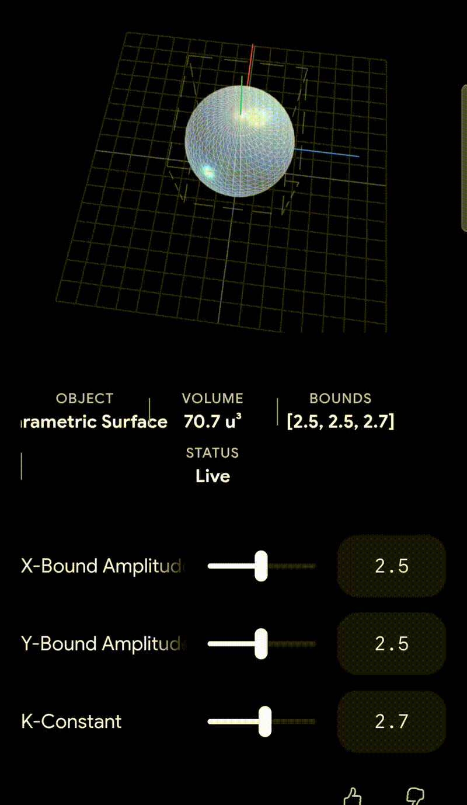

# DSSS — Deterministic Sovereign Solving System

**A Z3-drop-in SMT solver with CAD backend, typed circuit DSL, and ZK witness generation.**

## Demos




[](LICENSE)
[]()
[]()

**Author:** Ahmad Ali Parr  
**Trust:** Bel Esprit D'Accord Irrevocable Trust

---

## What This Is

DSSS is a deterministic solver system designed as a drop-in replacement for Z3 in the LiquidHaskell pipeline, with three additions Z3 cannot provide:

1. **Non-linear arithmetic** via Cylindrical Algebraic Decomposition (CAD)
2. **Typed circuit DSL** — compile-time width verification via GHC TypeNats/GADTs
3. **ZK witness generation** — maps LH Horn clause output to Circom ZK circuits

---

## Why Z3 Is Not Enough

| Limitation | Z3 | DSSS |
|---|---|---|
| Non-linear arithmetic (x² + y² ≤ 1) | Timeout / unknown | CAD — complete |
| TypeNat constants in refinements (#2750) | Fails | Native |
| Proof certificates | None | DRAT-like |
| ZK circuit generation | None | Circom output |
| Deterministic seed | No | Yes (seed=0) |

---

## Architecture

```
LiquidHaskell / liquid-fixpoint
        |
        | SMT-LIB2 query stream
        v
    dsss executable
        |
        +-- SGMT stylesheet (Lisp syntax, SASS-inspired)
        +-- Typed core IR
        +-- Horn-clause normalizer
        +-- Solving engine
              |- Congruence closure (EUF)
              |- Difference-logic / Simplex (LIA)
              |- Bit-vector bit-blasting
              |- Predicate abstraction / CEGAR (KVars)
              |- CAD for QF_NRA
              |- Proof trace + model emitter
```

---

## Circuit DSL

Type-level width verification at compile time — wiring mismatches are GHC type errors with custom diagnostics:

```haskell
-- Width mismatch caught at compile time, not runtime
aluPipeline :: Circuit 128 64
aluPipeline = Xor :>>>: Reg :>>>: Not

-- Custom error message on mismatch:
-- "Circuit Topology Error: Wiring Invariant Violation
--  Upstream output bus width:  128
--  Downstream input bus width: 64"
```

---

## ZK Pipeline

LH refinement constraints → SMT-LIB2 → Circom ZK circuit → 3D CAD geometry:

```
LH Horn clause
    ↓
SMT-LIB2 (Scala parser)
    ↓
Circom Z3_ConstantProductSolver (DEX AMM invariant)
    ↓
ZK witness (valid solution space)
    ↓
TrigCADCompiler → OpenSCAD polyhedron
```

---

## Six Execution Invariants

1. **Width preservation** — `lower : Circuit g w -> LoweredWord g w`
2. **Graph separation** — combinational nodes form a DAG
3. **State discipline** — every temporal feedback crosses a register
4. **Policy confinement** — SASS chooses tactics, never meaning
5. **Replayability** — every node has a certificate to its typed source
6. **Property sort** — safety/temporal predicates consume only `Word g 1`

---

## Connection to c3-kernel

DSSS is the SMT-LIB2 interface layer. [c3-kernel](https://github.com/SNAPKITTYWEST/c3-kernel) is the full CAD engine underneath. Together they form the complete Z3 replacement stack.

---

© 2026 Bel Esprit D'Accord Irrevocable Trust · Patent Pending · θ = 89/2462
