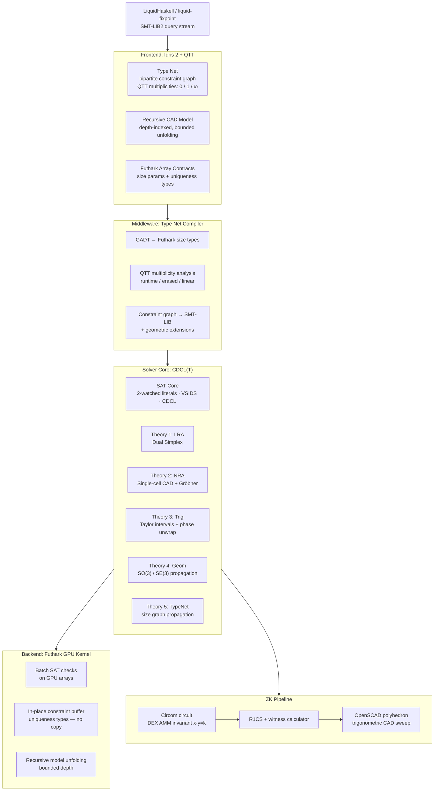
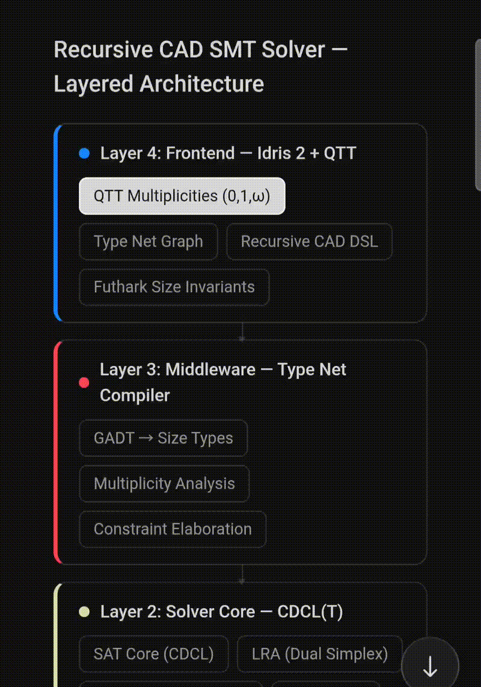

# DSSS — Deterministic Sovereign Solving System

[](LICENSE)
[](LICENSE)
[]()
[]()
[](src/Dsss/Circuit/)
[](src/Dsss/Frontend/)
[](src/Dsss/Backend/)
[](src/Dsss/Zk/ConstraintSolver.scala)
[](src/Dsss/Zk/ConstantProductSolver.circom)

Z3 gives up on `x² + y² ≤ 1`. It has no opinion on TypeNat constants in refinement predicates. It produces no proof certificate. DSSS is the solver that finishes the job.





**Author:** Ahmad Ali Parr  
**Trust:** Bel Esprit D'Accord Irrevocable Trust

---

## Why Z3 Is Not Enough

Z3 is excellent for quantifier-free linear arithmetic and EUF. Outside that envelope, it degrades:

| Constraint Class | Z3 | DSSS |
|---|---|---|
| Non-linear real arithmetic (`x·y = k`, `x² + y² ≤ r²`) | Timeout / `unknown` | Single-cell CAD + Gröbner — complete |
| GHC TypeNat constants in refinement predicates | Fails (issue #2750) | Native TypeNet theory |
| Trigonometric constraints (`sin θ + cos θ = c`) | No support | Taylor intervals + phase unwrapping |
| SO(3) / SE(3) geometric invariants | No support | Geom theory, constraint propagation |
| Proof certificates | None | DRAT-like certificate per lowered node |
| ZK circuit generation | None | Circom netlist + R1CS + witness |
| Deterministic replay | Non-deterministic | `seed=0`, lexicographic model minimization |
| Solver policy control | None | SGMT stylesheet — Lisp/SASS syntax |

The root cause for the TypeNat failure: Z3's LIA engine treats every integer as an uninterpreted symbol at the SMT-LIB boundary. GHC TypeNats carry compile-time witnesses (`KnownNat`, `CmpNat`) that have no standard SMT-LIB encoding. DSSS's TypeNet theory propagates size constraints natively as a bipartite constraint graph, consuming `KnownNat` evidence directly.

---

## Architecture: Four-Layer Stack

```
┌──────────────────────────────────────────────────────┐
│  FRONTEND: Idris 2 + QTT                             │
│   ├─ Type Net  (bipartite constraint graph,          │
│   │             0-multiplicity = compile-time only)  │
│   ├─ Recursive CAD model (depth-indexed, bounded)    │
│   └─ Futhark-invariant array contracts               │
└────────────────────┬─────────────────────────────────┘
                     │  elaboration
                     ▼
┌──────────────────────────────────────────────────────┐
│  MIDDLEWARE: Type Net Compiler                        │
│   ├─ GADT → Futhark size-dependent types             │
│   ├─ QTT multiplicity → runtime / erased / linear   │
│   └─ Constraint graph → SMT-LIB + geometric ext.    │
└────────────────────┬─────────────────────────────────┘
                     │  translation
                     ▼
┌──────────────────────────────────────────────────────┐
│  SOLVER CORE: CDCL(T) — five active theories         │
│   ├─ SAT Core  (2-watched literals, VSIDS, CDCL)     │
│   ├─ Theory 1  LRA  — Dual Simplex                   │
│   ├─ Theory 2  NRA  — Single-cell CAD + Gröbner      │
│   ├─ Theory 3  Trig — Taylor intervals, phase unwrap │
│   ├─ Theory 4  Geom — SO(3)/SE(3) propagation        │
│   └─ Theory 5  TypeNet — size graph propagation      │
└────────────────────┬─────────────────────────────────┘
                     │  fixed-point iteration
                     ▼
┌──────────────────────────────────────────────────────┐
│  BACKEND: Parallel Constraint Kernel (Futhark)        │
│   ├─ Batch SAT checks on GPU arrays                  │
│   ├─ In-place constraint buffer updates              │
│   │   (uniqueness types — no copy, no alias)         │
│   └─ Recursive model unfolding, bounded depth        │
└──────────────────────────────────────────────────────┘
```

The Type Net is the structural invariant that crosses all four layers. In Idris 2 it is a bipartite graph `G = (T ∪ C, E)` where `T` are type nodes with size parameters, `C` are constraint nodes, and edges carry QTT multiplicities (`0` = erased, `1` = linear, `ω` = unrestricted). In the CDCL(T) core, TypeNet theory walks the same graph as a propagator.

---

## Typed Circuit DSL

The circuit DSL is a GADT in `src/Dsss/Circuit/DSL.hs` indexed by input and output bus widths as `GHC.TypeNats`. Width mismatches are rejected by GHC — not at runtime, not by an assertion, by the type checker.

```haskell
data Circuit (i :: Nat) (o :: Nat) where
  Id      :: Circuit n n
  Split   :: Circuit n (n + n)
  Join    :: Circuit (n + n) n
  And     :: Circuit (2 * n) n
  Or      :: Circuit (2 * n) n
  Xor     :: Circuit (2 * n) n
  Not     :: Circuit n n
  Reg     :: KnownNat n => Circuit n n
  (:***:) :: Circuit i1 o1 -> Circuit i2 o2 -> Circuit (i1 + i2) (o1 + o2)
  (:>>>:) :: (CheckWire m1 m2 ~ m) => Circuit i m1 -> Circuit m2 o -> Circuit i o
```

Wire composition `(:>>>:)` enforces the invariant through `CheckWire`, a closed type family that emits a structured compile-time diagnostic on mismatch:

```haskell
type family CheckWire (m1 :: Nat) (m2 :: Nat) :: Nat where
  CheckWire m m   = m
  CheckWire m1 m2 = TypeError
    (     'Text "Circuit Topology Error: Wiring Invariant Violation"
    ':$$: 'Text "Upstream output bus width:   " ':<>: 'ShowType m1
    ':$$: 'Text "Downstream input bus width:  " ':<>: 'ShowType m2
    ':$$: 'Text "Cannot safely bridge "
          ':<>: 'ShowType m1 ':<>: 'Text " wires to "
          ':<>: 'ShowType m2 ':<>: 'Text " terminals."
    )
```

A 64-bit ALU pipeline that the type checker rejects if any bus width is wrong:

```haskell
-- 128-bit XOR → 64-bit registered → invert
aluPipeline :: Circuit 128 64
aluPipeline = Xor :>>>: Reg :>>>: Not
```

Slice bounds are also enforced statically. `Gate.hs` carries `ValidSlice` constraints that fire at compile time:

```haskell
Slice :: (Fits lo w, Fits hi w)
      => Wire g w -> Fin (hi - lo + 1) -> Gate g (hi - lo + 1)
```

A slice that references bit 63 of a 32-bit wire is a compile error, not a runtime panic.

---

## ZK Pipeline: LH Refinements to OpenSCAD Polyhedron

```
LiquidHaskell Horn clause (SMT-LIB string S)
         |
         |  fastparse (Scala)
         v
    SMT AST
         |
         |  translate
         v
  Circom signal netlist N
    |- Variables  -> public / private signals
    |- Numerals   -> constant signals
    |- Binary ops -> intermediate signals via <==
    |- Each reserve x, y -> Num2Bits(n) + GreaterThan(n)
    `- DEX core:  surface <== x * y;  surface === k;
         |
         |  compile
         v
     R1CS + witness calculator
         |
         |  run with public k
         v
   witness (x_s, y_s) / 2^fb -> unscaled (x, y)
         |
         |  trigonometric sweep
         v
   for i,j in [0, steps):
     theta = i*2pi/steps,  phi = j*pi/steps
     emit (x*sin(phi)*cos(theta),  y*sin(phi)*sin(theta),  x*y*cos(phi))
         |
         |  triangulate
         v
   OpenSCAD polyhedron
```

The core Circom template (`src/Dsss/Zk/ConstantProductSolver.circom`):

```circom
template Z3_ConstantProductSolver(nBits) {
    signal input x;
    signal input y;
    signal input constraint_target;

    signal surface_curve <== x * y;
    surface_curve === constraint_target;

    component rangeX = Num2Bits(nBits);
    rangeX.in <== x;

    component rangeY = Num2Bits(nBits);
    rangeY.in <== y;

    component greaterThan = GreaterThan(nBits);
    greaterThan.in[0] <== x;
    greaterThan.in[1] <== 0;
    greaterThan.out === 1;
}

component main = Z3_ConstantProductSolver(64);
```

The DEX constant-product invariant `x·y = k` replaces exponential DPLL(T) search for the non-linear fragment with static arithmetic evaluation. Because the solution space is bounded by the AMM curve, the witness is a single evaluation, not a search.

**Concrete demo (nBits=16, fb=8):**

| Signal | Value |
|---|---|
| x_s (scaled) | 5120 |
| y_s (scaled) | 7680 |
| k | 39,321,600 |
| Unscaled witness | (20, 30) |
| CAD sweep radii | X=20, Y=30, Z=±600 |

**Proof obligations discharged by the pipeline:**

| ID | Claim |
|---|---|
| P1 | Parser output is isomorphic to SMT-LIB input — structural induction on grammar |
| P2 | Circom netlist enforces the same relation as the AST — induction on AST depth |
| P3 | `surface === x·y ∧ surface === k` iff `x·y = k` — direct field equality |
| P4 | `Num2Bits` guarantees `0 ≤ x,y < 2^n`; `GreaterThan` guarantees `x > 0` — circomlib correctness |
| P5 | Sweep points lie on the surface `X·Y = (x·y)sin²φ` — parametric substitution |
| P6 | Circuit reveals only public input `k` — standard Groth16/PLONK ZK property |

---

## Idris 2 QTT Frontend

Recursive CAD models are depth-indexed `CADModel : (depth : Nat) -> Type`. QTT multiplicities prevent aliasing:

```idris
data CADModel : (depth : Nat) -> Type where
    Primitive : (0 d : Nat) -> Mesh -> CADModel d
    Transform : (1 m : CADModel d) -> (0 R : SO3) -> (0 t : R3) -> CADModel d
    Union     : (1 a : CADModel d) -> (1 b : CADModel d) -> CADModel d
    Recurse   : (0 d : Nat) -> (1 f : CADModel d -> CADModel (S d)) -> CADModel (S d)
```

`(0 d : Nat)` — depth is erased at runtime; it is a compile-time proof witness only.  
`(1 m : CADModel d)` — model is consumed exactly once by `Transform`; aliasing is a type error.  
`(0 R : SO3)` — rotation matrices are erased; they appear only in the constraint set, not in the assembled geometry.

Unfolding terminates by structural induction on `maxDepth`. UNSAT at bounded depth is sound if the unsat core is depth-independent.

---

## Futhark GPU Backend

The parallel kernel (`src/Dsss/Backend/kernel.fut`) processes constraint batches with size-checked arrays and uniqueness-typed buffers:

```futhark
-- [n] is a size parameter: shapes and transforms are guaranteed to match
def check_constraints [n] (shapes: [n][3]f64) (transforms: [n][4][4]f64) : [n]bool =
    map2 (\s T ->
        let det     = det4x4 T
        let ortho   = is_orthogonal T
        let bounded = all (\x -> x > 0 && x < 1e6) s
        in  det > 0.999 && det < 1.001 && ortho && bounded
    ) shapes transforms

-- * prefix = uniqueness type: no alias, in-place update safe
def propagate_net [n] (buf: *[n]f64) (updates: [n]f64) : *[n]f64 =
    map2 (\old new -> if new > old then new else old) buf updates
```

Uniqueness types (`*[n]f64`) are Futhark's answer to Rust's borrow checker for GPU memory: the compiler guarantees that `buf` has no live aliases at the call site, enabling destructive in-place updates without allocation. Array size parameters `[n]` are checked at compile time — not at the GPU kernel boundary.

---

## SGMT Stylesheet System

Solver policy is expressed in SGMT (Lisp syntax, SASS-inspired semantics). Policy selects tactics and representations; it never alters circuit semantics (Invariant I4).

```lisp
(sheet liquid-default
  (target smtlib2)
  (logic auto)

  (match (horn-clause :linear-arithmetic true)
    (pipeline
      normalize-anf
      eliminate-let
      canonicalize-arith
      congruence-close
      solve-lia
      infer-kvars-cegar))

  (match (term :operator "mod")
    (rewrite (euclidean-mod-normal-form)))

  (match (query :kind unsat)
    (emit
      :certificate drat-like
      :diagnostics concise
      :counterexample minimized))

  (policy
    :deterministic true
    :max-refinement-rounds 32
    :seed 0
    :model-minimization lexicographic))
```

The lowering pass selects SGMT rules after SSA construction and before theory expansion. The CSS-like selector syntax targets circuit nodes by opcode and width:

```scss
word[op="WAdd"][width<="16"]    { lower: ripple;          proof: local-adder;  }
word[op="WAdd"][width>="17"]    { lower: carry-lookahead; proof: prefix-adder; }
property[kind="Always"]         { engine: k-induction; k: 4; }
state-cone[register-count>="8"] { engine: pdr; }
```

---

## Six Lowering Invariants

These are compiler correctness conditions enforced by the type system. A violation is an internal bug, not a user error.

```
I1. Width preservation:   lower : Circuit g w -> LoweredWord g w
I2. Graph separation:     combinational nodes form a DAG
I3. State discipline:     every temporal feedback path crosses a register
I4. Policy confinement:   SGMT chooses tactics, never meaning
I5. Replayability:        every lowered node carries a certificate to its typed source
I6. Property sort:        safety predicates consume only Word g 1
```

Width indices are never erased between source and target. The lowering pass carries an explicit `WidthWitness (w :: Nat)` for every `LoweredWord g w`, and `reifyWidth` throws `ZeroWidthCircuit` before any node is emitted if `KnownNat` evidence resolves to zero.

---

## SMT-LIB Extension

DSSS extends SMT-LIB 2 with geometric sorts and size-parameterized recursive definitions:

```smtlib
(declare-sort SO3 0)
(declare-sort SE3 0)
(declare-sort Mesh 1)

(declare-fun rotation (Real Real Real) SO3)
(declare-fun rigid (SO3 Real Real Real) SE3)

(declare-size n Int)
(declare-size m Int)
(assert-size (= n (+ (* 2 m) 1)))

(define-recursive-fun assembly ((d Int)) Mesh[n]
  (ite (<= d 0)
       base-mesh
       (union (assembly (- d 1))
              (transform (assembly (- d 1)) T))))
```

---

## Theory Complexity

| Theory | Algorithm | Complexity | Bottleneck |
|---|---|---|---|
| LRA | Dual Simplex | Polynomial | Pivot operations |
| NRA | Single-cell CAD + Gröbner | Single exponential | Real root isolation |
| Trig | Taylor intervals + phase unwrapping | Linear per iteration | Taylor evaluation |
| Geom | SO(3)/SE(3) propagation | Polynomial | Matrix arithmetic |
| TypeNet | Constraint graph propagation | O(|V| + |E|) | Graph traversal |
| Futhark batch eval | map2 over GPU arrays | O(n) parallel | GPU memory bandwidth |

**Known limitations:**  
Taylor linearization of trigonometric constraints is incomplete — Lindemann-Weierstrass decidability is beyond practical SMT scope. SAT at bounded recursion depth does not guarantee SAT of the infinite unfolding; UNSAT is sound only when the unsat core is depth-independent. The Trig theory is not stably infinite in the Nelson-Oppen sense, requiring explicit care in shared-variable combination with LRA.

---

---

## Source Layout

```
src/Dsss/
  Backend/kernel.fut              Futhark parallel constraint kernel
  Circuit/
    Core.hs                       Wire, Bus, Port, Signal GADT types
    DSL.hs                        Circuit GADT, CheckWire type family
    Gate.hs                       Gate constructors, ValidSlice constraints
    TypeNat.hs                    Width/Depth/Arity type synonyms, Assert/NonZero/Fits/SameWidth
    Vec.hs                        Size-indexed bit vector
    Builder.hs                    Build monad, node emission
    Lower/Pass.hs                 LowerM monad, proof obligations, certificates, hash-cons memo
  Frontend/
    CADModel.idr                  Idris 2 QTT recursive CAD model, unfold
    TypeNet.idr                   Type Net bipartite graph, multiplicity, propagation
  Theory/Trig.py                  Taylor interval solver, SingleCellCAD conflict explanation
  Zk/
    ConstraintSolver.scala        SMT-LIB fastparse parser, TrigCADCompiler, OpenSCAD emit
    ConstantProductSolver.circom  DEX AMM ZK circuit template (nBits-parameterized)
styles/liquid-default.sgmt        SGMT solver policy stylesheet
examples/
  demo_1.gif
  demo_2.gif
  demo_constraint_polyhedron.scad Auto-generated witness geometry (x=20, y=30, k=600)
```

---

## Foundation: C³ Kernel

DSSS is the SMT-LIB2 interface layer. The solver core underneath is [**C³ — Calculus of Constrained Constructions**](https://github.com/SNAPKITTYWEST/c3-kernel).

C³ provides what no external solver dependency can:

- **CAD from scratch** — Cylindrical Algebraic Decomposition (Collins 1975), Sturm sequences, Thom encodings, full quantifier elimination over real closed fields
- **CDCL(T) from scratch** — no Z3, no CVC5, no external SMT dependency in the core
- **Differentiable constraints** — `∇f(x) = g(x)` as a first-class constraint type via Dex-style AD
- **Dependent type theory** — `⟨t | C⟩` terms where unsatisfiable constraints are construction errors, not runtime failures

| | C³ | DSSS |
|---|---|---|
| **Role** | Type theory + solver foundation | SMT-LIB2 interface + circuit DSL + ZK pipeline |
| **Entry point** | `⟨t | C⟩` constraint terms | SMT-LIB2 query stream from LiquidHaskell |
| **Coming from type theory** | Start here | — |
| **Coming from LiquidHaskell** | — | Start here |

→ [c3-kernel on GitHub](https://github.com/SNAPKITTYWEST/c3-kernel) · [c3-kernel GitHub Pages](https://snapkittywest.github.io/c3-kernel/)

---

## Documentation

| Guide | Description |
|---|---|
| [Getting Started](docs/GETTING_STARTED.md) | Clone, build, generate the ZK witness, open the OpenSCAD polyhedron |
| [Circuit DSL](docs/CIRCUIT_DSL.md) | Write and compose typed circuits; width errors at compile time; 4-bit ripple carry adder worked example |
| [ZK Pipeline](docs/ZK_PIPELINE.md) | End-to-end: LH refinement → Circom → R1CS → witness → OpenSCAD |
| [Solver Policy](docs/SOLVER_POLICY.md) | Write SGMT stylesheets to control solver tactics; `liquid-default.sgmt` annotated line by line |

Formal specifications are in [`spec/`](spec/):

- [`spec/ARCHITECTURE.md`](spec/ARCHITECTURE.md) — four-layer stack, unified judgment, theory complexity
- [`spec/LOWERING_SPEC.md`](spec/LOWERING_SPEC.md) — lowering pass contract, width equations, six invariants
- [`spec/ZK_QF_NRA_SPEC.md`](spec/ZK_QF_NRA_SPEC.md) — ZK-QF_NRA algorithm, proof obligations P1–P6

---

## Contributing

See [CONTRIBUTING.md](CONTRIBUTING.md) for dev environment setup, code style guidelines (HLint, Black, Futhark size naming), how to submit a PR, and what kinds of contributions are most needed.

---

## Security

See [SECURITY.md](SECURITY.md) for the vulnerability disclosure policy, response timeline, and what counts as a security issue in DSSS (solver soundness, ZK circuit holes, certificate forgery, side-channel leaks).  Do **not** report security issues via public GitHub Issues.

---

## Legal

**Copyright © BEL ESPRIT D ACCORD TRUST HOLDINGS INC. All rights reserved.**

Patent pending. The DSSS solver architecture, SGMT stylesheet system, ZK-QF_NRA pipeline, and typed circuit DSL are the subject of a pending patent application.

**Dual licensed:**
- **BSL-1.1** (primary) — research, evaluation, academic, and open-source use permitted. Commercial production use requires a written agreement with the Licensor. Converts to BSD-3-Clause on 2030-01-01.
- **BSD-3-Clause** (contributions) — contributions submitted via pull request are accepted under BSD-3-Clause. LiquidHaskell contributors are explicitly welcome; contribution terms are compatible with LiquidHaskell's own BSD-3-Clause license.

See [LICENSE](LICENSE) for full terms.
